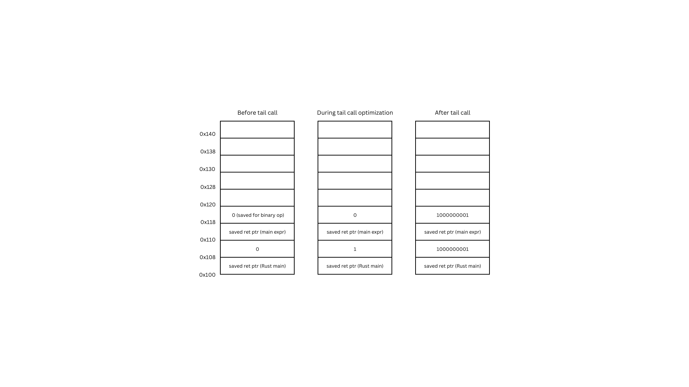

# Specification

Akhilan Ganesh, A15975349

## Concrete Syntax

The concrete syntax of a Snek program is shown below. This includes but is not limited to integers, booleans,
variables, let bindings, unary operators, binary operators, conditional and control expressions, functions,
and function calls.

```
<prog> := <defn>* <expr>
<defn> := (fun (<fname> <identifier>*) <expr>)
<expr> :=
  | <integer>
  | <boolean>
  | <tuple>
  | input
  | <identifier>
  | (let (<binding>+) <expr>)
  | (<op1> <expr>)
  | (<op2> <expr> <expr>)
  | (if <expr> <expr> <expr>)
  | (loop <expr>)
  | (break <expr>)
  | (set! <identifier> <expr>)
  | (tinit <expr:integer> <expr>)
  | (tset <expr:tuple> <expr:integer> <expr>)
  | (tget <expr:tuple> <expr:integer>)
  | (block <expr>+)
  | (<fname> <expr>*)

<integer>    := (-)?[0-9]*
<boolean>    := true | false
<tuple>      := (tuple <expr>*)
<expr:[value]>  := <expr> that holds type [value]

<op1> := add1 | sub1 | isnum | isbool | print
<op2> := + | - | * | < | > | >= | <= | =

<fname>      := [a-zA-z][a-zA-Z0-9]*
<identifier> := [a-zA-z][a-zA-Z0-9]*
<binding>    := (<identifier> <expr>)
```

Note that integers must be within the bounds $-2^{62}$ to $2^{62} - 1$. `input` refers to an optional
argument provided at runtime of the Snek binary.

## Abstract Syntax

The abstract syntax of Snek, parsed out of a .snek file and then compiled into instructions, is shown below. 

```
enum Op1 { Add1, Sub1, IsNum, IsBool, Print, }

enum Op2 { Plus, Minus, Times, Equal, Gt, Gte, Lt, Lte, }

enum Expr {
    Number(i64),
    Boolean(bool),
    Tuple(Vec<Expr>),
    Id(String),
    Let(Vec<(String, Expr)>, Box<Expr>),
    UnOp(Op1, Box<Expr>),
    BinOp(Op2, Box<Expr>, Box<Expr>),
    If(Box<Expr>, Box<Expr>, Box<Expr>),
    Loop(Box<Expr>),
    Break(Box<Expr>),
    Set(String, Box<Expr>),
    TInit(Box<Expr>, Box<Expr>),
    TSet(Box<Expr>, Box<Expr>, Box<Expr>),
    TGet(Box<Expr>, Box<Expr>),
    Block(Vec<Expr>),
    Call(String, Vec<Expr>),
}

struct Function {
    name : String,
    args : Vec<String>,
    body : Expr,
}

struct Program {
    defns : Vec<Function>,
    main : Expr,
}
```

## Value Representations

Values, such as integers, booleans, etc., are represented in the Snek runtime environment with two parts: a code and a tag. The tag is on the less significant part of the byte (includes LSB). The value representations are as follows. Note that the code reflects a decimal representation of the actual binary code part.

Value        | Tag Size | Code | Tag
-------------|:--------:|:----:|------:
integer      | 1 bit    |  n   | 0
tuple        | 2 bits   | addr | 01
true         | 2 bits   |  1   | 11
false        | 2 bits   |  0   | 11

## New Functionality: Safe-for-Space Tail Calls

The latest functionality added to the compiler is safe-for-space tail call optimization. 

First, whether or not an expression can have a tail call within is determined by a new expression
context variable `tail`. The new `ExprContext` struct representing expression context is:

```
/// Context to an Expr that helps with compilation
/// Context to an Expr that helps with compilation
#[derive(Copy, Clone)]
pub struct ExprContext<'a> {
    pub si : i32,                           // current stack index
    pub env : &'a HashMap<String, LocPtr>,  // variable environment
    pub loop_num : i32,                     // current loop identifier
    pub func_map : &'a HashMap<String,i32>, // function name map
    pub in_func : bool,                     // whether inside a function or not
    pub tail : TailContext,                 // whether a tail call can occur within this expression
    pub farity : usize                      // how many function arguments
}
```

where `TailContext` is:

```
#[derive(Copy, Clone, PartialEq)]
pub enum TailContext {
    Invalid,    // no tail calls here
    Valid,      // tail call can be here
    Loop,       // tail call can only be in a break expr
}
```

The compiler sets all superexpressions (function expressions and main expressions) to have an expression
context with `tail` set to `TailContext::Valid`. Even though the main expression also has `tail` set to
valid, as we will see the compiler checks also that an expression is part of a function before performing
tail call optimization.

Some sub-expressions are such that function calls would not be tail calls. This includes all block sub-expressions except for the last, the conditional expression in an if expression, any sub-expressions in let-bindings, within loops (unless in a break expression), any sub-expression to unary or binary operations, and finally any sub-expression to the tuple operations. In these instances, the expression context passed in has `tail` set to `TailContext::Invalid`.

An example of this is the new handling of `Expr::Block`:

```
Expr::Block(exprs) => {
    for i in 0..exprs.len() {
        if i != exprs.len() - 1 {
            instrs.append(&mut compile_expr(&exprs[i], ExprContext { tail: TailContext::Invalid, ..ctxt }, lbl));
        } else {
            instrs.append(&mut compile_expr(&exprs[i], ctxt, lbl));
        }
    }
},
```

Additionally, tail calls within loops poses a peculiar problem. Expressions within loops should not have
tail calls unless it is a break expression AND the loop itself is the last evaluated expression of the
function. This means that rather than have a tail call context that is binary, we need a tail call context
that is ternary. The value `TailContext::Loop` is set on sub-expressions when a loop expression is the last
evaluated expression of a function. When a break expression is compiled, if the tail context is for `Loop`
(this implementation has a wider check of just not being `Invalid`), then its sub-expressions have
`TailContext::Valid` for the tail context. This allows sub-expressions for break expressions to be
recognized as tail calls.

The implementation of `Expr::Loop` and `Expr::Break` is shown below:

```
Expr::Loop(e) => {
    let tail_ctxt = if ctxt.tail == TailContext::Valid { TailContext::Loop } else { TailContext::Invalid };
    let new_ctxt = ExprContext { loop_num: *lbl, tail: tail_ctxt, ..ctxt };
    *lbl += 1;
    let loop_lbl = format!("loop_{}", new_ctxt.loop_num);
    instrs.push(Instr::Label(Val::Label(loop_lbl.clone())));
    instrs.append(&mut compile_expr(e, new_ctxt, lbl));
    instrs.push(Instr::Jmp(Val::Label(loop_lbl.clone())));
    instrs.push(Instr::Label(Val::Label(format!("endloop_{}", new_ctxt.loop_num))));
},
Expr::Break(e) => {
    if ctxt.loop_num > 0 {
        let tail_ctxt = if ctxt.tail != TailContext::Invalid { TailContext::Valid } else { TailContext::Invalid };
        instrs.append(&mut compile_expr(e, ExprContext { tail: tail_ctxt, ..ctxt }, lbl));
        instrs.push(Instr::Jmp(Val::Label(format!("endloop_{}", ctxt.loop_num))));
    } else {
        panic!("Invalid break outside of loop");
    }
},
```

Lastly, of course, is the actual implementation of tail call optimization to be safe-for-space.
Shown below is the code for `Expr::Call` handling. Look towards the last if/else expression.
What occurs on a normal non-tail call basis is that argument values are pushed onto the stack
(maintaining 16-byte alignment) past the stack pointer and other important values on the stack.
Of course, these values are referenced directly from these positions as parameters to the next
function once the function call occurs.

However, for tail calls, once these stack values for new function arguments have been allocated,
they are dynamically transferred back in the stack to reallocate the function space for the new
function, thus preserving space overall.

Note that function tail calls with a higher arity than the current function are not optimized,
as this would cause issues with rewriting unrelated stack values.

```
Expr::Call(fname, exprs) => {
    if let Some(n) = ctxt.func_map.get(fname) {
        if *n != exprs.len() as i32 {
            panic!("Incorrect number of function parameters for \'{}\'", fname);
        }
    } else {
        panic!("Unknown function \'{}\'", fname);
    }
    let offset = if (exprs.len() as i32+ctxt.si) % 2 == 0 { 0 } else { 1 };
    let mut sii     = ctxt.si+offset;
    for e in exprs.iter().rev() {
        let loc : LocPtr = LocPtr::LStack(-sii*WORD_SIZE);
        instrs.append(&mut compile_expr(e, ExprContext { si: sii, tail: TailContext::Invalid, ..ctxt }, lbl));
        instrs.push(Instr::Mov(loc.value(), Val::Reg(Reg::RAX)));
        sii += 1;
    }
    sii -= 1;
    if ctxt.tail == TailContext::Valid && ctxt.in_func {
        let mut arg_i : i32 = exprs.len().try_into().unwrap();
        let diff : i32 = arg_i+ctxt.si+offset;    // arg_i here = exprs.len()
        while arg_i > 0 {
            instrs.push(Instr::Mov(Val::Reg(Reg::RAX), Val::MemPtr(Reg::RSP, (arg_i-diff)*WORD_SIZE)));
            instrs.push(Instr::Mov(Val::MemPtr(Reg::RSP, arg_i*WORD_SIZE), Val::Reg(Reg::RAX)));
            arg_i -= 1;
        }
        instrs.push(Instr::Jmp(Val::Label(fname.clone())));
    } else {
        instrs.push(Instr::Sub(Val::Reg(Reg::RSP), Val::Imm((sii*WORD_SIZE) as i64)));
        instrs.push(Instr::Call(Val::Label(fname.clone())));
        instrs.push(Instr::Add(Val::Reg(Reg::RSP), Val::Imm((sii*WORD_SIZE) as i64)));
    }
}
```

## Heap-Allocated Data Diagram

This diagram is located in `doc/heap-allocation.jpg`.

## Testing

Three tests were prepared, showcasing safe-for-space tail calls. These tests are located in the `input` directory of the repo. They are also duplicated in the `tests` directory.

One can test non-safe-for-space tail calls by changing the `START_TAIL` constant on line 34 in `utils.rs` from `TailContext::Valid` to `TailContext::Invalid` before compiling any program with tail calls.

### `tail1.snek` with Stack Diagram

```
(fun (overflow n)
    (if (<= n 1000000000)
        (overflow (add1 n))
        true
    )
)

(overflow 0)
```

The above is a simple program featuring a self-recursive tail call implementation. The program will overflow the stack if tail calls are not memory optimized for the stack. When tail calls are safe for space, this program outputs `true`.

A stack diagram showing the stack at each stage of this program is located in `doc/stack_tail_call.png`. It
shows the stack right before the tail call, then during the tail call optimization, where function argument
stack values are updated, and finally after the tail call returns, which shows how the tail call completely
preserved stack space.



### `tail2.snek`

```
(fun (isodd n)
  (if (< n 0)
      (isodd (- 0 n))
      (if (= n 0)
          false
          (iseven (sub1 n))
      )
  )
)
(fun (iseven n)
  (if (= n 0)
      true
      (isodd (sub1 n))
  )
)
(iseven 1000000001)
```

This program features tail calls in functions that recursively call each other. It will overflow the stack if tail calls are not memory optimized for the stack. When tail calls are safe for space, this program outputs `false` since the number is not even.

### `tail3.snek`

```
(fun (overflowloop n)
    (if (> n 0)
        (block
            (let ((i 0))
                (loop
                    (if (< i 10)
                        (set! i (add1 i))
                        (break (overflowloop (sub1 n)))
                    )
                )
            )
        )
        true
    )
)
(overflowloop 99999999)
```

This program showcases tail calls inside loops, which can only happen inside a `break` expression. This program will overflow the stack if tail calls are not memory optimized for the stack. When tail calls are safe for space, this program outputs `true`.

## Credits

No LLM was used. Stack overflow was not consulted.

The `mov` instruction was referenced from https://www.felixcloutier.com/x86/mov.